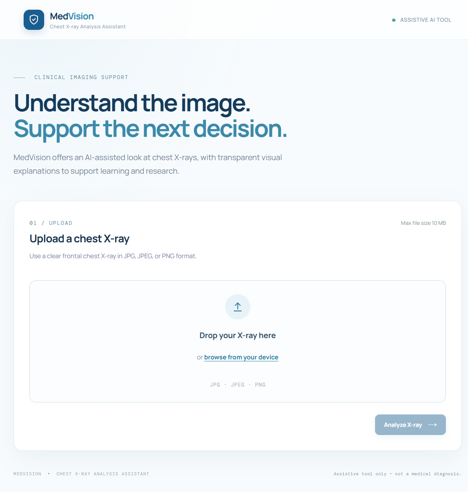
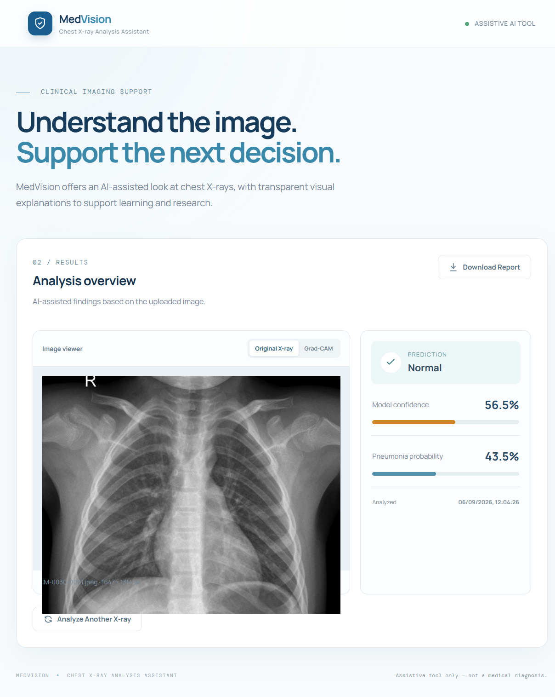
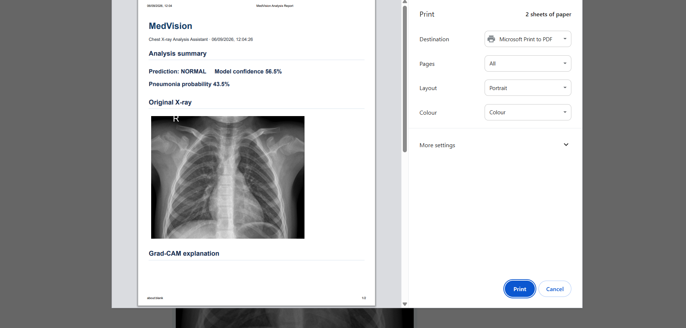
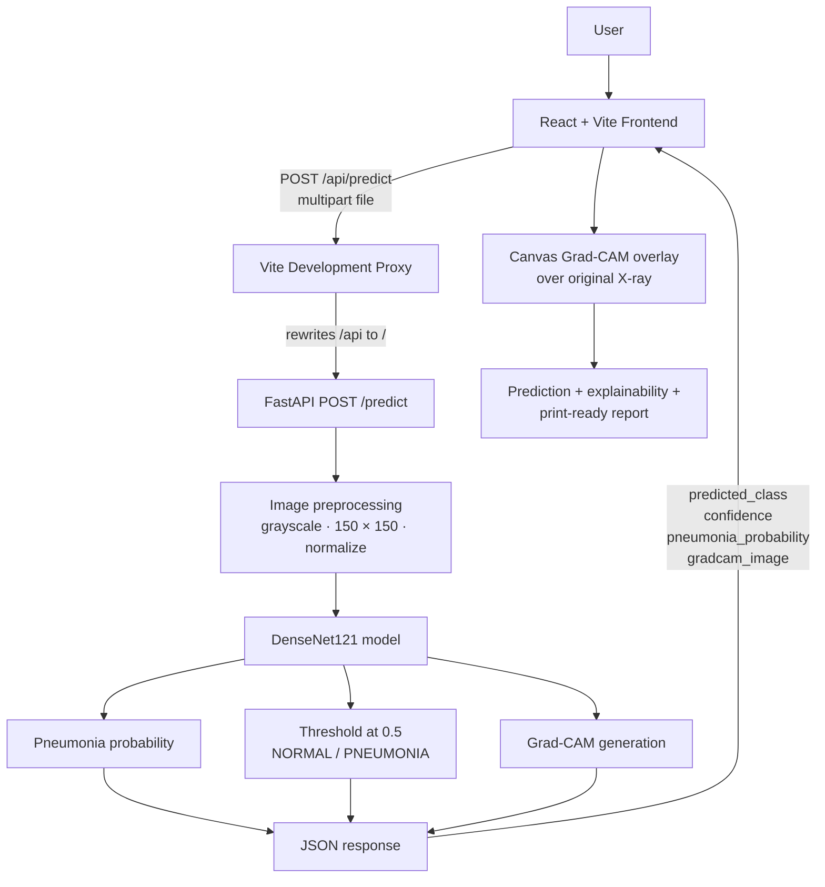

# MedVision

### Medical Chest X-ray Pneumonia Detection & Explainability System

MedVision is an AI-assisted chest X-ray classification system that predicts `NORMAL` or `PNEUMONIA` from an uploaded image. It also generates a Grad-CAM explanation so users can see which image regions influenced the model prediction.

[](https://www.python.org/)
[](https://www.tensorflow.org/)
[](https://fastapi.tiangolo.com/)
[](https://react.dev/)
[](https://vite.dev/)

> MedVision is an assistive research/educational tool and is not a medical diagnostic system.

---

## Project Preview

| Upload screen | Prediction result | Download Report |
|:---:|:---:|:---:|
|  |  |  |
| Upload a chest X-ray for analysis. | Review the predicted class and confidence metrics. | Download the analysis output report as pdf. |

---

## Overview

Pneumonia classification from chest X-rays is challenging because clinically relevant patterns can be subtle, variable in location, and visually similar to normal anatomical structures. A classification score alone also gives limited insight into why a model produced its prediction.

MedVision combines binary image classification with Grad-CAM visual explanations. The application accepts a chest X-ray, displays the predicted class and confidence-related probabilities, and overlays the model’s activation map on the original image so the underlying anatomy remains visible.

## Key Capabilities

- Chest X-ray upload with drag-and-drop support
- `NORMAL` / `PNEUMONIA` classification
- DenseNet121 transfer-learning model with a frozen ImageNet backbone
- Model confidence and pneumonia probability display
- Grad-CAM visual explanation
- Original X-ray ↔ Grad-CAM toggle
- FastAPI inference API
- React/Vite frontend
- Responsive clinical-style interface
- Browser print workflow for a report that can be saved as PDF
- JPG/JPEG/PNG upload validation and a 10 MB client-side size limit
- Processing, validation, and error states

## System Architecture



### Components

- **Frontend:** The React application handles file selection, preview, validation, inference requests, result presentation, Grad-CAM compositing, and report printing.
- **Vite proxy:** During local development, `/api` requests are proxied to the FastAPI server at `http://127.0.0.1:8000`.
- **Backend:** FastAPI receives the uploaded file, preprocesses it, runs the saved Keras model, creates a Grad-CAM heatmap, and returns JSON.
- **Model:** The saved DenseNet121-based Keras model accepts a normalized grayscale input, converts it to three channels internally, and produces a sigmoid output.
- **Visualization:** The frontend decodes the returned base64 heatmap, smooths and scales it to the original X-ray dimensions, colorizes it, and composites it with intensity-based transparency.

## ML Pipeline

1. The user uploads a chest X-ray.
2. The image is converted to grayscale.
3. It is resized to `150 × 150` pixels.
4. Pixel values are normalized from `[0, 255]` to `[0, 1]`.
5. The grayscale input is represented as three channels for DenseNet121 processing.
6. DenseNet121 extracts visual features.
7. A sigmoid output performs binary classification.
8. The sigmoid output is exposed as the pneumonia probability.
9. A Grad-CAM map is generated from the DenseNet121 feature representations and classifier gradients.
10. The frontend interpolates, smooths, colorizes, and overlays the map on the original X-ray.

## Model Development

### Baseline CNN

The baseline model uses:

- `Conv2D` layers with ReLU activations
- `MaxPooling2D` layers
- `Flatten`
- Dense layers
- A final sigmoid output for binary classification

The input shape is `150 × 150 × 1`.

### Class Weighting

The training set is class-imbalanced, with more pneumonia images than normal images. Class weights were calculated from the class counts and passed to training so that errors from the minority class had greater influence on optimization.

### Data Augmentation

The augmentation experiment used:

- Random rotation
- Random zoom
- Random translation

### Transfer Learning

The final architecture uses DenseNet121 initialized with ImageNet weights and `include_top=False`. Its backbone is frozen, followed by global average pooling, dropout, and a one-unit sigmoid classifier. The resulting model is saved as `medvision_densenet121.keras`.

The notebook also contains an earlier fine-tuning experiment, but the selected final model is the frozen-backbone DenseNet121 configuration used by the application.

## Model Evaluation

The following comparison uses the verified evaluation results recorded for the project’s consistent test-set comparison:

| Model | Accuracy | Precision | Sensitivity | Specificity | F1 Score | ROC-AUC |
|---|---:|---:|---:|---:|---:|---:|
| Baseline CNN | 73.56% | 70.42% | 99.49% | 30.34% | 82.47% | 90.75% |
| CNN + Class Weight | 77.40% | 73.71% | 99.23% | 41.03% | 84.59% | 89.99% |
| CNN + Augmentation + Class Weight | 83.33% | 80.43% | 96.92% | 60.68% | 87.91% | 93.41% |
| DenseNet121 | 86.70% | 84.04% | 97.18% | 69.23% | 90.13% | 94.35% |

DenseNet121 was selected as the final model because it achieved the strongest overall performance in the consistent evaluation. These are development/test-set metrics, not clinical accuracy, and they do not establish medical-grade performance or readiness for clinical diagnosis.

## Dataset

The project uses the **Chest X-Ray Images (Pneumonia)** dataset with 5,863 images across the `NORMAL` and `PNEUMONIA` classes.

- The source dataset contains `train`, `test`, and `val` directories.
- The project uses an 80/20 split from the training directory for training and validation.
- The provided tiny `val` directory is not used as the main validation set.
- The test set contains 624 images: 234 `NORMAL` and 390 `PNEUMONIA`.

The dataset is local-only and is not included in the repository. The root `.gitignore` excludes `data/chest_xray/`.

## Explainability with Grad-CAM

Grad-CAM provides a spatial explanation of a convolutional model’s output by weighting feature maps with the gradients associated with the pneumonia score. In this project, the map is generated from the DenseNet121 feature layer used by the backend’s Grad-CAM implementation.

The backend returns the normalized heatmap as a base64-encoded PNG in `gradcam_image`. The frontend decodes it, scales it to the original uploaded image dimensions with canvas interpolation, applies smoothing and intensity-based alpha, then composites the colored map over the original X-ray.

The highlighted regions represent image areas that influenced the model prediction. They are not confirmed pathology, a segmentation mask, or a medical finding.

## Backend API

The FastAPI application exposes two endpoints:

### `GET /`

Returns a simple service-status response identifying the API and model family.

### `POST /predict`

Accepts a multipart form upload:

- **Field:** `file`
- **Frontend-accepted formats:** JPG, JPEG, and PNG
- **Backend behavior:** the uploaded content is decoded with Pillow; the API does not add a separate MIME-type validation layer

Representative response:

```json
{
  "predicted_class": "PNEUMONIA",
  "confidence": 87.4,
  "pneumonia_probability": 87.4,
  "gradcam_image": "iVBORw0KGgo..."
}
```

`confidence` and `pneumonia_probability` are returned as percentages. `gradcam_image` contains the base64-encoded PNG heatmap generated by the backend.

## Frontend

The React/Vite frontend provides:

- Upload and drag-and-drop interaction
- Local image preview and dimension display
- JPG/JPEG/PNG and 10 MB validation
- Processing and error feedback
- Results dashboard with prediction, confidence, and pneumonia probability
- Original X-ray / Grad-CAM toggle
- Canvas-based Grad-CAM overlay visualization
- Print-ready report generation through the browser print dialog, including the original X-ray and Grad-CAM visualization when available
- Responsive layouts for smaller screens
- Visible focus styles, semantic controls, image alternative text, and status messaging for core interactions

## Project Structure

```text
CNN_Practice/
├── backend/
│   ├── main.py
│   └── gradcam.py
├── frontend/
│   ├── public/
│   │   ├── favicon.svg
│   │   └── icons.svg
│   ├── src/
│   │   ├── assets/
│   │   │   ├── hero.png
│   │   │   ├── react.svg
│   │   │   └── vite.svg
│   │   ├── App.css
│   │   ├── App.jsx
│   │   ├── index.css
│   │   └── main.jsx
│   ├── index.html
│   ├── package.json
│   └── vite.config.js
├── models/
│   └── medvision_densenet121.keras
├── notebooks/
│   └── 01_data_exploration.ipynb.ipynb
├── data/
│   └── chest_xray/              # local dataset; ignored by Git
├── outputs/                     # generated artifacts; selected subdirectories ignored
├── .gitignore
├── package-lock.json
└── README.md
```

## Local Setup

The commands below are intended for Windows PowerShell. Use two terminals: one for the backend and one for the frontend.

### Backend

The repository does not currently include a Python requirements file. Install the packages used directly by the backend:

```powershell
cd backend
python -m pip install tensorflow fastapi uvicorn pillow numpy python-multipart
python -m uvicorn main:app --reload
```

The API starts at `http://127.0.0.1:8000`.

### Frontend

```powershell
cd frontend
npm install
npm run dev
```

Open the local Vite URL shown in the terminal, normally `http://127.0.0.1:5173`.

The frontend sends requests to `/api/predict`; `frontend/vite.config.js` proxies that path to the backend’s `/predict` endpoint.

### Frontend checks

```powershell
cd frontend
npm run lint
npm run build
```

## Usage

1. Start the backend and frontend.
2. Open the Vite development URL.
3. Upload a frontal chest X-ray by browsing or dragging it into the upload area.
4. Select **Analyze X-ray**.
5. Review the prediction, confidence, pneumonia probability, and Grad-CAM explanation.
6. Use the viewer toggle to switch between the original image and the explanation overlay.
7. Select **Download Report** to open the print-ready analysis report and choose a printer or **Save as PDF** in the browser print dialog.

## Limitations and Disclaimer

MedVision is an educational/research project. Its predictions and Grad-CAM visualizations may be incorrect, incomplete, or misleading. Grad-CAM highlights model-influential regions; it does not confirm disease or replace clinical interpretation.

> Assistive tool only — not a medical diagnosis.

Do not use this software as a substitute for evaluation by a qualified medical professional.
